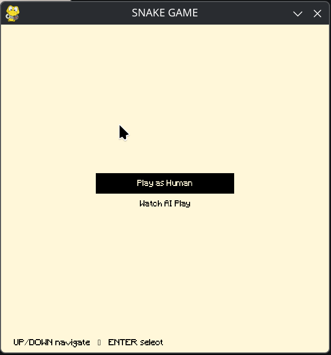
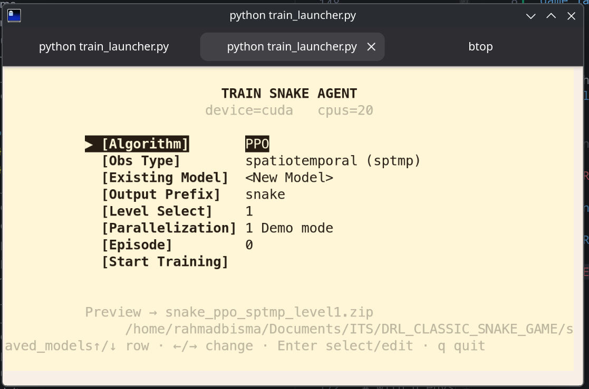
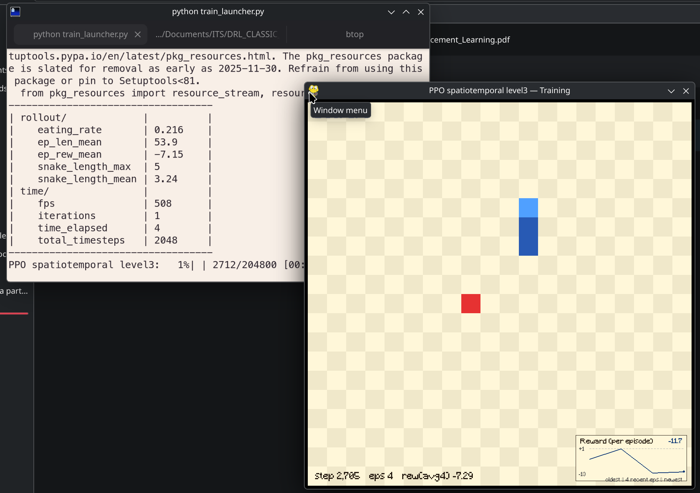
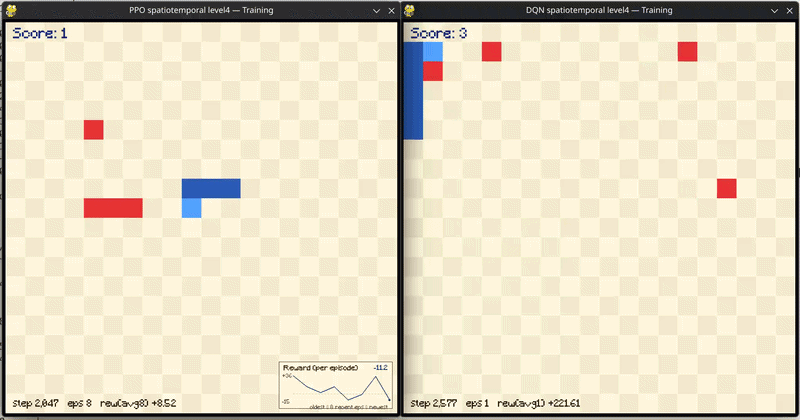
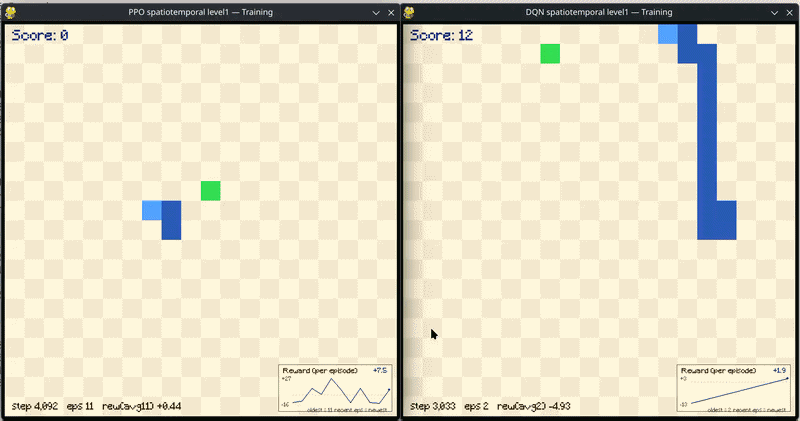
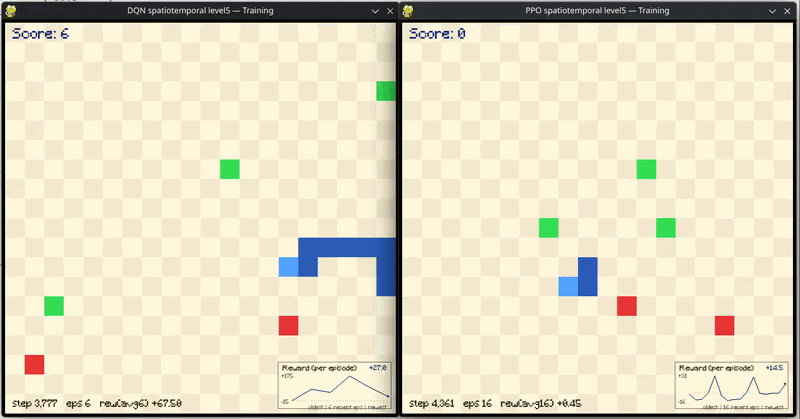
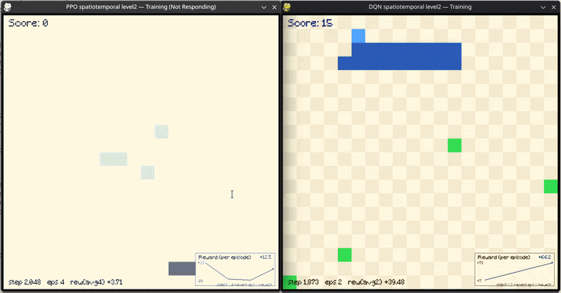

# DRL_CLASSIC_SNAKE_GAME

Implementation and Comparison of DQN and PPO algorithm for Grid-Based Modified Classic Nokia Snake Game Completition

# GUIDE

```bash
game_launcher.py
```

> Game Launcher - to open the game

```bash
train_launcher.py
```

> Train Interface - to train model pararelism: 1 to open training visualization

```bash
tensorboard --logdir logs/tb_logs/
```

> Tensorboard - visualize training process

# DOCUMENTS

[Paper Reference](./document/Deep_Q-Snake_An_Intelligent_Agent_Mastering_the_Snake_Game_with_Deep_Reinforcement_Learning.pdf)

[Presentation](./document/presentation.pptx)

[Text Report](./document/report.pdf)

# DEMO









